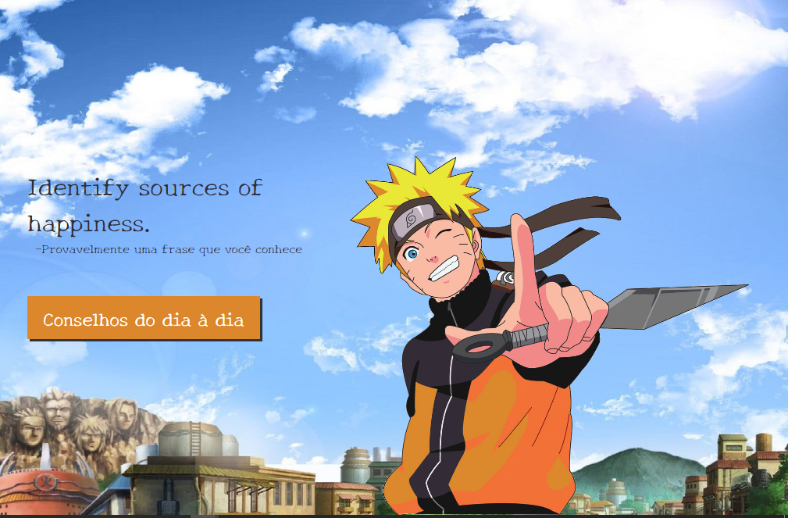

# Advices

### Sobre:

- Aplicação desenvolvida no bootcamp da DIO.
- Advices gera uma frase aleatória, seja de um filme, série ou desenho, o anfitrião da aplicação é o ilustre "Ò vô me tornar Hokage (Naruto)". 
- A frase é obtida através da API [Adivceslip ](https://api.adviceslip.com/).

### Tecnologias usadas:

- React
- Styled-components
- Vite

### Como iniciar:

  - Clone ou baixe esse repositório
  - Instale os módulos `npm install`
  - Rode o comando inicial `npm run dev`

### link da aplicação:
  
  -
